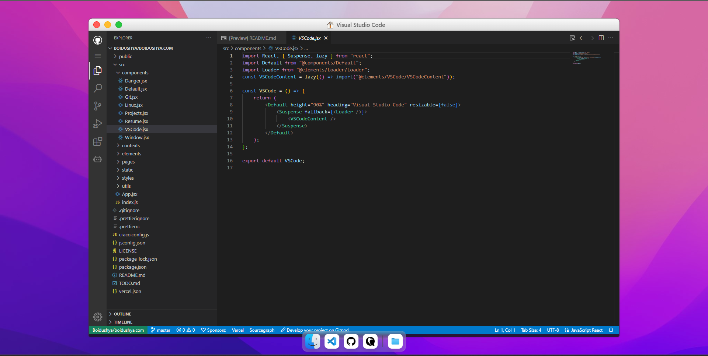

<h2 align="center">
 

<a  href="http://cihanduran.com/"  target="_blank">cihanduran.com</a>

</h2>

  

 

  

  

## TL;DR

  

You can fork this repo to modify and make changes of your own. Please give me proper credit by linking back to [kreafik](https://github.com/kreafik/cihanduran.com). Thanks!

  

## Built With

  

My personal portfolio <a  href="http://cihanduran.com/"  target="_blank">cihanduran.com</a> made using ReactJS and styled-components emulating a macOS terminal among other features. 
  
  
This project was built using these technologies.

  

- React.js

- Node.js

- CSS3

- VsCode

- Vercel

  

## Features

  

**📖 Multi-Page Layout**

  

**🎨 Styled with React-Js and Css with easy to customize colors**

  

**📱 Fully Responsive**

  

## Getting Started

  

Clone down this repository. You will need `node.js` and `git` installed globally on your machine.

  

## 🛠 Installation and Setup Instructions

  

1. Installation: `npm install`

  

2. In the project directory, you can run: `npm start`

  

Runs the app in the development mode.

Open [http://localhost:3000](http://localhost:3000) to view it in the browser.

The page will reload if you make edits.

  

## Usage Instructions

  

Open the project folder and Navigate to `/src/components/`.  

You will find all the components used and you can edit your information accordingly.

  

### Show your support

  

Give a ⭐ if you like this website!

  